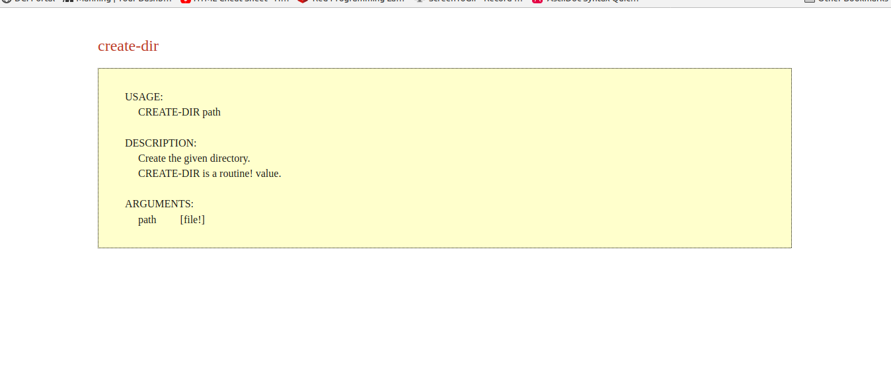

 

# write-help

Writes interactive help content for `any-function!` types to HTML, Asciidoc, or Markdown files


### Usage

```red
./red write-help.red function! asciidoc

./red write-help.red action! html

./red write-help.red -a, --all markdown

```

To compile, add this to your script: 

` #include %/<your-path-to>/help.red `

----

**html ouput sample**


